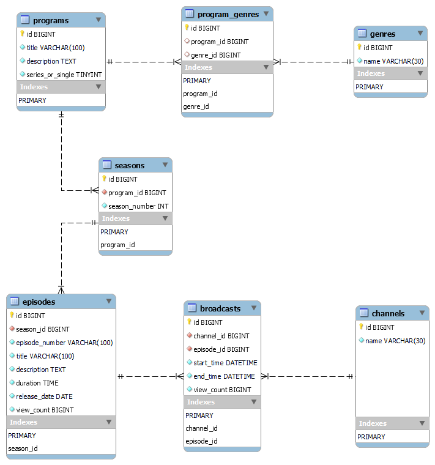

# インターネットTV (DB設計 構築 SQL)



- [Step 1: DB設計](./docs/step_1_table_design.md)
- [Step 2: テーブル構築](./docs/step_2_table_build.md)
- [Step 3: SQLでデータ抽出](./docs/step_3_sql_extraction.md)

## テーブル一覧

```shell
mysql> SHOW TABLES;
+------------------------+
| Tables_in_streaming_tv |
+------------------------+
| broadcasts             |
| channels               |
| episodes               |
| program_genres         |
| genres                 |
| programs               |
| seasons                |
+------------------------+
7 rows in set (0.00 sec)
```

## テーブル詳細

### Table：channels

```shell
mysql> DESCRIBE channels;
+--------------+-------------+------+-----+---------+----------------+
| Field        | Type        | Null | Key | Default | Extra          |
+--------------+-------------+------+-----+---------+----------------+
| channel_id   | bigint      | NO   | PRI | NULL    | auto_increment |
| channel_name | varchar(30) | NO   |     | NULL    |                |
+--------------+-------------+------+-----+---------+----------------+
2 rows in set (0.01 sec)
```

### Table：genres
```shell
mysql> DESCRIBE genres;
+------------+-------------+------+-----+---------+----------------+
| Field      | Type        | Null | Key | Default | Extra          |
+------------+-------------+------+-----+---------+----------------+
| genre_id   | bigint      | NO   | PRI | NULL    | auto_increment |
| genre_name | varchar(30) | NO   |     | NULL    |                |
+------------+-------------+------+-----+---------+----------------+
2 rows in set (0.00 sec)
```

### Table：programs
```shell
mysql> DESCRIBE programs;
+------------------+--------------+------+-----+---------+----------------+
| Field            | Type         | Null | Key | Default | Extra          |
+------------------+--------------+------+-----+---------+----------------+
| program_id       | bigint       | NO   | PRI | NULL    | auto_increment |
| title            | varchar(100) | NO   |     | NULL    |                |
| description      | text         | NO   |     | NULL    |                |
| series_or_single | tinyint      | NO   |     | NULL    |                |
+------------------+--------------+------+-----+---------+----------------+
4 rows in set (0.00 sec)
```

### Table：program_genres
```shell
mysql> DESCRIBE program_genres;
+-------------------+--------+------+-----+---------+----------------+
| Field             | Type   | Null | Key | Default | Extra          |
+-------------------+--------+------+-----+---------+----------------+
| genre_registry_id | bigint | NO   | PRI | NULL    | auto_increment |
| program_id        | bigint | YES  | MUL | NULL    |                |
| genre_id          | bigint | YES  | MUL | NULL    |                |
+-------------------+--------+------+-----+---------+----------------+
3 rows in set (0.00 sec)
```

### Table：seasons
```shell
mysql> DESCRIBE seasons;
+---------------+--------+------+-----+---------+----------------+
| Field         | Type   | Null | Key | Default | Extra          |
+---------------+--------+------+-----+---------+----------------+
| season_id     | bigint | NO   | PRI | NULL    | auto_increment |
| program_id    | bigint | NO   | MUL | NULL    |                |
| season_number | int    | NO   |     | NULL    |                |
+---------------+--------+------+-----+---------+----------------+
3 rows in set (0.00 sec)
```

### Table：episodes
```shell
mysql> DESCRIBE episodes;
+----------------+--------------+------+-----+---------+----------------+
| Field          | Type         | Null | Key | Default | Extra          |
+----------------+--------------+------+-----+---------+----------------+
| episode_id     | bigint       | NO   | PRI | NULL    | auto_increment |
| program_id     | bigint       | NO   | MUL | NULL    |                |
| season_id      | bigint       | YES  | MUL | NULL    |                |
| episode_number | varchar(100) | NO   |     | NULL    |                |
| title          | varchar(100) | NO   |     | NULL    |                |
| description    | text         | NO   |     | NULL    |                |
| duration       | time         | NO   |     | NULL    |                |
| release_date   | date         | NO   |     | NULL    |                |
| view_count     | bigint       | NO   |     | NULL    |                |
+----------------+--------------+------+-----+---------+----------------+
9 rows in set (0.00 sec)
```

### Table：broadcasts
```shell
mysql> DESCRIBE broadcasts;
+--------------+----------+------+-----+---------+----------------+
| Field        | Type     | Null | Key | Default | Extra          |
+--------------+----------+------+-----+---------+----------------+
| broadcast_id | bigint   | NO   | PRI | NULL    | auto_increment |
| channel_id   | bigint   | NO   | MUL | NULL    |                |
| program_id   | bigint   | NO   | MUL | NULL    |                |
| season_id    | bigint   | NO   | MUL | NULL    |                |
| episode_id   | bigint   | NO   | MUL | NULL    |                |
| start_time   | datetime | NO   |     | NULL    |                |
| end_time     | datetime | NO   |     | NULL    |                |
| view_count   | bigint   | NO   |     | NULL    |                |
+--------------+----------+------+-----+---------+----------------+
8 rows in set (0.00 sec)
```

## テストデータ

### Table：channels (Test Data)

```shell
mysql> SELECT * FROM `channels`;
+------------+---------------------------+
| channel_id | channel_name              |
+------------+---------------------------+
|          1 | アニメチャンネル1         |
|          2 | アニメチャンネル2         |
|          3 | ドラマチャンネル1         |
|          4 | ドラマチャンネル2         |
+------------+---------------------------+
4 rows in set (0.00 sec)
```

### Table：genres (Test Data)

```shell
mysql> SELECT * FROM `genres`;
+----------+-----------------+
| genre_id | genre_name      |
+----------+-----------------+
|        1 | アニメ          |
|        2 | ドラマ          |
|        3 | アクション      |
+----------+-----------------+
3 rows in set (0.00 sec)
```

### Table：programs (Test Data)

```shell
+------------+-----------------------+-------------------------------------------------------+------------------+
| program_id | title                 | description                                           | series_or_single |
+------------+-----------------------+-------------------------------------------------------+------------------+
| 1          | 鬼滅の刃              | 大正時代の鬼殺隊と炭治郎の戦いを描くアニメ............| 1                |
| 2          | 逃げるは恥だが役に立つ| OLと医師の新垣結衣と星野源演じるみくりと智の恋愛成長..| 1                |
+------------+-----------------------+-------------------------------------------------------+------------------+
2 rows in set (0.00 sec)
```

### Table：program_genres (Test Data)

```shell
mysql> SELECT * FROM `program_genres`;
+-------------------+------------+----------+
| genre_registry_id | program_id | genre_id |
+-------------------+------------+----------+
|                 1 |          1 |        1 |
|                 2 |          1 |        3 |
|                 3 |          2 |        2 |
+-------------------+------------+----------+
3 rows in set (0.00 sec)
```

### Table：seasons (Test Data)

```shell
mysql> SELECT * FROM `seasons`;
+-----------+------------+---------------+
| season_id | program_id | season_number |
+-----------+------------+---------------+
|         1 |          1 |             1 |
|         2 |          1 |             2 |
|         3 |          2 |             1 |
+-----------+------------+---------------+
3 rows in set (0.00 sec)
```

### Table：episodes (Test Data)

```shell
+----+------------+-----------+----------------+------------------------------------+--------------------------------+
| ID | Program_ID | Season_ID | Episode_Number | Title                              | Description                    |
+----+------------+-----------+----------------+------------------------------------+--------------------------------+
| 1  | 1          | 1         | 1              | 第1話 鬼との遭遇                   | 鬼との遭遇のはじまり           |
| 2  | 1          | 1         | 2              | 第2話 修行の日々                   | 鬼殺隊の訓練生活               |
| 3  | 1          | 1         | 3              | 第3話 水の呼吸法                   | 水の呼吸法の修得               |
| 4  | 1          | 1         | 4              | 第4話 闘いの始まり                 | 鬼との壮絶な闘い               |
| 5  | 1          | 1         | 5              | 第5話 禰豆子の決意                 | 禰豆子の覚悟                   |
| 6  | 1          | 1         | 6              | 第6話 鬼殺隊への加入               | 新たな仲間との出会い           |
| 7  | 1          | 1         | 7              | 第7話 剣士としての成長             | 主人公の剣士としての成長       |
| 8  | 1          | 1         | 8              | 第8話 蜘蛛鬼の脅威                 | 強敵・蜘蛛鬼の脅威             |
| 9  | 1          | 1         | 9              | 第9話 新たな仲間                   | 新仲間たちの加入               |
| 10 | 1          | 1         | 10             | 第10話 選ばれし者                  | 選ばれた刃の行方               |
| 11 | 1          | 1         | 11             | 第11話 鬼殺隊の使命                | 鬼殺隊の新たな使命             |
| 12 | 1          | 1         | 12             | 第12話 鬼の棲む山                  | 鬼の棲む山への挑戦             |
| 13 | 1          | 1         | 13             | 第13話 獣の魔術                    | 獣との魔術の闘い               |
| 14 | 1          | 1         | 14             | 第14話 鬼舞辻無惨                  | 最強鬼・無惨との対決           |
| 15 | 1          | 1         | 15             | 第15話 新たな修行                  | さらなる修行と成長             |
| 16 | 1          | 1         | 16             | 第16話 鬼殺隊の試練                | 鬼殺隊の新たな試練             |
| 17 | 1          | 1         | 17             | 第17話 蝶屋敷の謎                  | 謎の蝶屋敷への探索             |
| 18 | 1          | 1         | 18             | 第18話 鬼との再戦                  | 再びの鬼との壮絶な戦い         |
| 19 | 1          | 1         | 19             | 第19話 禰豆子の復活                | 禰豆子の驚異的な復活           |
| 20 | 1          | 1         | 20             | 第20話 柱合会議                    | 柱合会議の開催                 |
| 21 | 1          | 1         | 21             | 第21話 柱合会議の結末              | 柱合会議の結末と新たな使命     |
| 22 | 1          | 1         | 22             | 第22話 新たな敵の登場              | 新たな強敵の出現               |
| 23 | 1          | 1         | 23             | 第23話 修行と成長                  | 修行と新たな力の開花           |
| 24 | 1          | 1         | 24             | 第24話 鬼の襲来                    | 鬼の本拠地への最終決戦         |
| 25 | 1          | 1         | 25             | 第25話 最終決戦                    | 壮絶な最終決戦と結末           |
| 26 | 1          | 1         | 26             | 第26話 鬼殺隊の結末                | 鬼殺隊の運命の結末             |
| 27 | 1          | 2         | 1              | 第1話 新たな敵との戦い             | 新たな敵との壮絶な戦闘         |
| 28 | 1          | 2         | 2              | 第2話 剣士たちの覚悟               | 剣士たちの覚悟と新たな使命     |
| 29 | 1          | 2         | 3              | 第3話 謎の鬼の出現                 | 謎の鬼との遭遇                 |
| 30 | 1          | 2         | 4              | 第4話 鬼殺隊の新たな仲間           | 鬼殺隊の新たな仲間たち         |
| 31 | 1          | 2         | 5              | 第5話 剣士たちの修行               | 剣士たちの厳しい修行           |
| 32 | 1          | 2         | 6              | 第6話 鬼との再戦                   | 再びの鬼との戦闘               |
| 33 | 1          | 2         | 7              | 第7話 新たな鬼殺隊士               | 新たな鬼殺隊士たち             |
| 34 | 1          | 2         | 8              | 第8話 鬼の脅威再び                 | 鬼の新たな脅威                 |
| 35 | 1          | 2         | 9              | 第9話 柱合会議                     | 柱合会議と新たな使命           |
| 36 | 1          | 2         | 10             | 第10話 鬼殺隊再編                  | 鬼殺隊の再編成                 |
| 37 | 1          | 2         | 11             | 第11話 新たな鬼殺隊柱              | 新たな鬼殺隊柱たち             |
| 38 | 1          | 2         | 12             | 第12話 最終決戦へ                  | 最終決戦への向かう             |
| 39 | 1          | 2         | 13             | 第13話 鬼との激闘                  | 鬼たちとの激しい闘い           |
| 40 | 2          | 3         | 1              | 第1話 夏目の新しい仕事について     | 夏目の新しい仕事に関する出来事 |
| 41 | 2          | 3         | 2              | 第2話 夫婦生活についての新たな展開 | 夫婦生活の新たな展開           |
| 42 | 2          | 3         | 3              | 第3話 新たな問題と障害に立ち向かう | 新たな問題への挑戦             |
| 43 | 2          | 3         | 4              | 第4話 仕事と家庭のバランスを取る   | 仕事と家庭のバランスの探求     |
| 44 | 2          | 3         | 5              | 第5話 友情と結婚生活の葛藤         | 友情と結婚生活の葛藤           |
| 45 | 2          | 3         | 6              | 第6話 新たな家族問題の発生         | 新たな家族問題の発生           |
| 46 | 2          | 3         | 7              | 第7話 夫婦関係の変化               | 夫婦関係の変化                 |
| 47 | 2          | 3         | 8              | 第8話 家庭内外の新たな展開         | 家庭内外の新たな展開           |
| 48 | 2          | 3         | 9              | 第9話 家族との絆を深める           | 家族との絆を深める             |
| 49 | 2          | 3         | 10             | 第10話 未来への希望                | 最終回                         |
+----+------------+-----------+----------------+-----------------------------------------+---------------------------+
```

### Table：broadcasts (Test Data)

```shell
mysql> SELECT * FROM `broadcasts`;
+--------------+------------+------------+-----------+------------+---------------------+---------------------+------------+
| broadcast_id | channel_id | program_id | season_id | episode_id | start_time          | end_time            | view_count |
+--------------+------------+------------+-----------+------------+---------------------+---------------------+------------+
|            1 |          1 |          1 |         1 |          1 | 2023-11-01 00:00:00 | 2023-11-01 00:30:00 |      60000 |
|            2 |          1 |          1 |         1 |          2 | 2023-11-02 00:30:00 | 2023-11-02 01:00:00 |      70000 |
|            3 |          1 |          1 |         1 |          3 | 2023-11-03 01:00:00 | 2023-11-03 01:30:00 |      80000 |
|            4 |          1 |          1 |         1 |          4 | 2023-11-04 01:30:00 | 2023-11-04 02:00:00 |      90000 |
|            5 |          1 |          1 |         1 |          5 | 2023-11-05 02:00:00 | 2023-11-05 02:30:00 |      75000 |
|            6 |          1 |          1 |         1 |          6 | 2023-11-06 02:30:00 | 2023-11-06 03:00:00 |      85000 |
|            7 |          1 |          1 |         1 |          7 | 2023-11-07 03:00:00 | 2023-11-07 03:30:00 |      95000 |
|            8 |          1 |          1 |         1 |          8 | 2023-11-08 03:30:00 | 2023-11-08 04:00:00 |     105000 |
|            9 |          1 |          1 |         1 |          9 | 2023-11-09 04:00:00 | 2023-11-09 04:30:00 |      90000 |
|           10 |          1 |          1 |         1 |         10 | 2023-11-10 04:30:00 | 2023-11-10 05:00:00 |     100000 |
|           11 |          1 |          1 |         1 |         11 | 2023-11-11 05:00:00 | 2023-11-11 05:30:00 |     110000 |
|           12 |          1 |          1 |         1 |         12 | 2023-11-12 05:30:00 | 2023-11-12 06:00:00 |     120000 |
|           13 |          1 |          1 |         1 |         13 | 2023-11-13 06:00:00 | 2023-11-13 06:30:00 |     130000 |
|           14 |          1 |          1 |         1 |         14 | 2023-11-14 06:30:00 | 2023-11-14 07:00:00 |     140000 |
|           15 |          1 |          1 |         1 |         15 | 2023-11-15 07:00:00 | 2023-11-15 07:30:00 |     150000 |
|           16 |          1 |          1 |         1 |         16 | 2023-11-16 07:30:00 | 2023-11-16 08:00:00 |     160000 |
|           17 |          1 |          1 |         1 |         17 | 2023-11-17 08:00:00 | 2023-11-17 08:30:00 |     170000 |
|           18 |          1 |          1 |         1 |         18 | 2023-11-18 08:30:00 | 2023-11-18 09:00:00 |     180000 |
|           19 |          1 |          1 |         1 |         19 | 2023-11-19 09:00:00 | 2023-11-19 09:30:00 |     190000 |
|           20 |          1 |          1 |         1 |         20 | 2023-11-20 09:30:00 | 2023-11-20 10:00:00 |     200000 |
|           21 |          1 |          1 |         1 |         21 | 2023-11-01 00:00:00 | 2023-11-01 00:30:00 |      60000 |
|           22 |          1 |          1 |         1 |         22 | 2023-11-02 00:30:00 | 2023-11-02 01:00:00 |      70000 |
|           23 |          1 |          1 |         1 |         23 | 2023-11-03 01:00:00 | 2023-11-03 01:30:00 |      80000 |
|           24 |          1 |          1 |         1 |         24 | 2023-11-04 01:30:00 | 2023-11-04 02:00:00 |      90000 |
|           25 |          1 |          1 |         1 |         25 | 2023-11-05 02:00:00 | 2023-11-05 02:30:00 |      75000 |
|           26 |          1 |          1 |         1 |         26 | 2023-11-06 02:30:00 | 2023-11-06 03:00:00 |      85000 |
|           27 |          2 |          1 |         2 |         27 | 2023-11-07 03:00:00 | 2023-11-07 03:30:00 |      95000 |
|           28 |          2 |          1 |         2 |         28 | 2023-11-08 03:30:00 | 2023-11-08 04:00:00 |     105000 |
|           29 |          2 |          1 |         2 |         29 | 2023-11-09 04:00:00 | 2023-11-09 04:30:00 |      90000 |
|           30 |          2 |          1 |         2 |         30 | 2023-11-10 04:30:00 | 2023-11-10 05:00:00 |     100000 |
|           31 |          2 |          1 |         2 |         31 | 2023-11-12 05:00:00 | 2023-11-12 05:30:00 |     110000 |
|           32 |          2 |          1 |         2 |         32 | 2023-11-13 05:30:00 | 2023-11-13 06:00:00 |     120000 |
|           33 |          2 |          1 |         2 |         33 | 2023-11-14 06:00:00 | 2023-11-14 06:30:00 |     130000 |
|           34 |          2 |          1 |         2 |         34 | 2023-11-15 06:30:00 | 2023-11-15 07:00:00 |     140000 |
|           35 |          2 |          1 |         2 |         35 | 2023-11-16 07:00:00 | 2023-11-16 07:30:00 |     150000 |
|           36 |          2 |          1 |         2 |         36 | 2023-11-17 07:30:00 | 2023-11-17 08:00:00 |     160000 |
|           37 |          2 |          1 |         2 |         37 | 2023-11-18 08:00:00 | 2023-11-18 08:30:00 |     170000 |
|           38 |          2 |          1 |         2 |         38 | 2023-11-19 08:30:00 | 2023-11-19 09:00:00 |     180000 |
|           39 |          2 |          1 |         2 |         39 | 2023-11-20 09:00:00 | 2023-11-20 09:30:00 |     190000 |
|           40 |          3 |          2 |         3 |         40 | 2023-11-09 04:00:00 | 2023-11-09 04:30:00 |      90000 |
|           41 |          3 |          2 |         3 |         41 | 2023-11-10 04:30:00 | 2023-11-10 05:00:00 |     100000 |
|           42 |          3 |          2 |         3 |         42 | 2023-11-11 05:00:00 | 2023-11-11 05:30:00 |     110000 |
|           43 |          3 |          2 |         3 |         43 | 2023-11-12 05:30:00 | 2023-11-12 06:00:00 |     120000 |
|           44 |          3 |          2 |         3 |         44 | 2023-11-13 06:00:00 | 2023-11-13 06:30:00 |     130000 |
|           45 |          3 |          2 |         3 |         45 | 2023-11-14 06:30:00 | 2023-11-14 07:00:00 |     140000 |
|           46 |          3 |          2 |         3 |         46 | 2023-11-15 07:00:00 | 2023-11-15 07:30:00 |      95000 |
|           47 |          3 |          2 |         3 |         47 | 2023-11-16 07:30:00 | 2023-11-16 08:00:00 |     160000 |
|           48 |          3 |          2 |         3 |         48 | 2023-11-17 06:00:00 | 2023-11-17 06:30:00 |     160000 |
|           49 |          3 |          2 |         3 |         49 | 2023-11-18 06:30:00 | 2023-11-18 07:00:00 |      18000 |
|           50 |          4 |          2 |         3 |         40 | 2023-11-09 04:00:00 | 2023-11-09 04:30:00 |      90000 |
|           51 |          4 |          2 |         3 |         41 | 2023-11-10 04:30:00 | 2023-11-10 05:00:00 |     100000 |
|           52 |          4 |          2 |         3 |         42 | 2023-11-11 05:00:00 | 2023-11-11 05:30:00 |     110000 |
|           53 |          4 |          2 |         3 |         43 | 2023-11-12 05:30:00 | 2023-11-12 06:00:00 |     120000 |
|           54 |          4 |          2 |         3 |         44 | 2023-11-13 06:00:00 | 2023-11-13 06:30:00 |     130000 |
|           55 |          4 |          2 |         3 |         45 | 2023-11-14 06:30:00 | 2023-11-14 07:00:00 |     140000 |
|           56 |          4 |          2 |         3 |         46 | 2023-11-15 07:00:00 | 2023-11-15 07:30:00 |      95000 |
|           57 |          4 |          2 |         3 |         47 | 2023-11-16 07:30:00 | 2023-11-16 08:00:00 |     160000 |
|           58 |          4 |          2 |         3 |         48 | 2023-11-17 06:00:00 | 2023-11-17 06:30:00 |     160000 |
|           59 |          4 |          2 |         3 |         49 | 2023-11-18 06:30:00 | 2023-11-18 07:00:00 |      18000 |
+--------------+------------+------------+-----------+------------+---------------------+---------------------+------------+
59 rows in set (0.00 sec)
```
